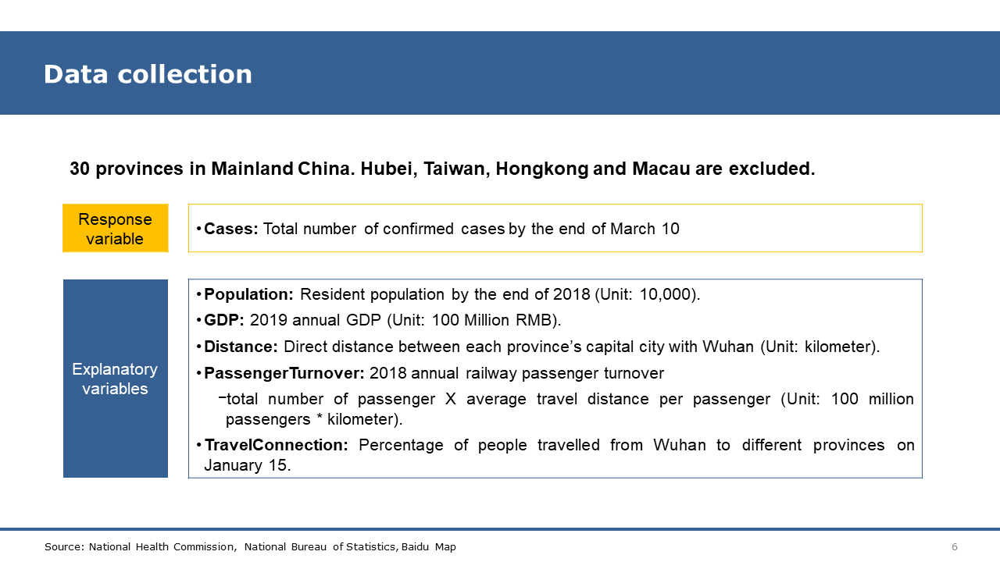
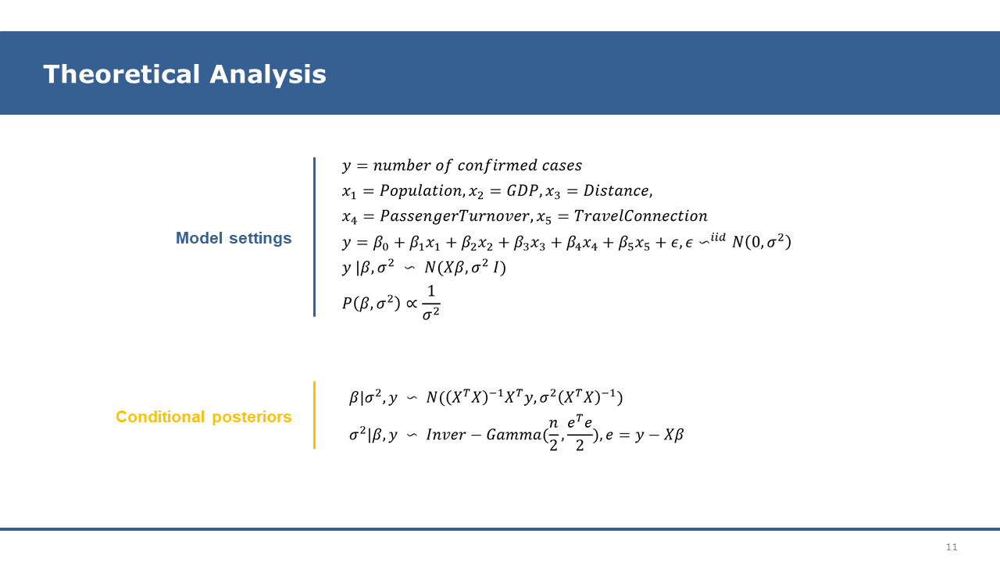
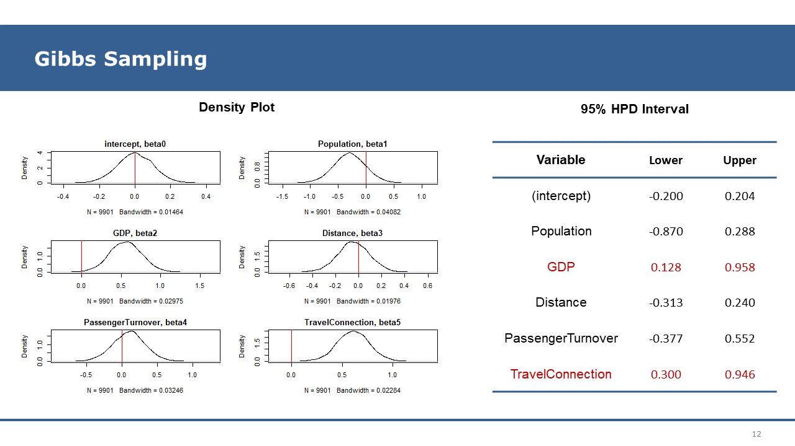

## 1. Introduction

This project aimed at exploring the explanatory factors for the number of confirmed cases in the provinces of Mainland China except Hubei. The factors I chose focused on the basic social and economic stats (e.g. population, GDP) and how close each province is connected with other provinces especially Hubei (e.g. distance to Wuhan, railway passenger turnover, travel connections).  

I applied Bayesian regression models and implemented Markov Chain Monte Carlo (Gibbs Sampling) to sample values of regression coefficients from their conditional posterior distribution.

## 2. Project Findings

Among the factors, this project found that TravelConnection and GDP are positively related to the number of confirmed COVID-19 cases.  

- TravelConnection is an indirectmatrics that reflects the number of people who travelled from Wuhan to other provinces and how close the two places are related with each other in terms of population migration before Spring Festival. As expected, it has a positive effect.  

- As for GDP, the result is a bit out of expectation. One possible explanation is that economic activities in China are highly correlated among provinces. People in provinces with higher GDP may have more travel needs. As a result, their exposure risk can also be higher.  

- In contrast, this project didn’t show any evidence that the population has an effect on the number of confirmed cases. One of the main reasons is that Chinese government took action to lockdown cities and force self-quarantine in a relatively quick way, and these orders were executed strictly, which effectively decreased inter-personal contact and slowed down local spread in each province.  

